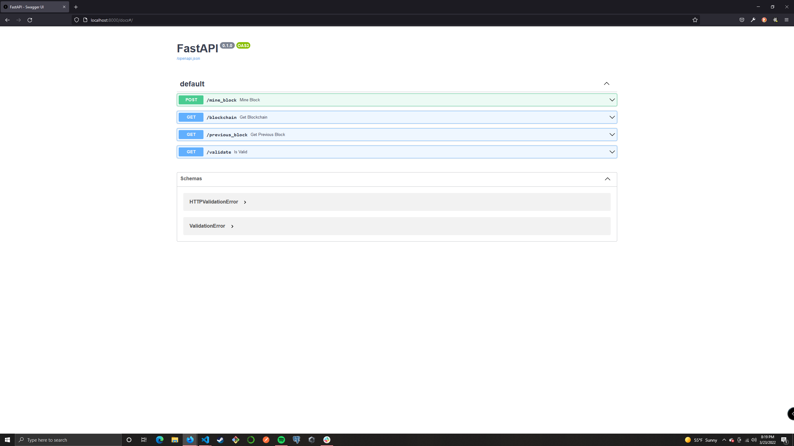
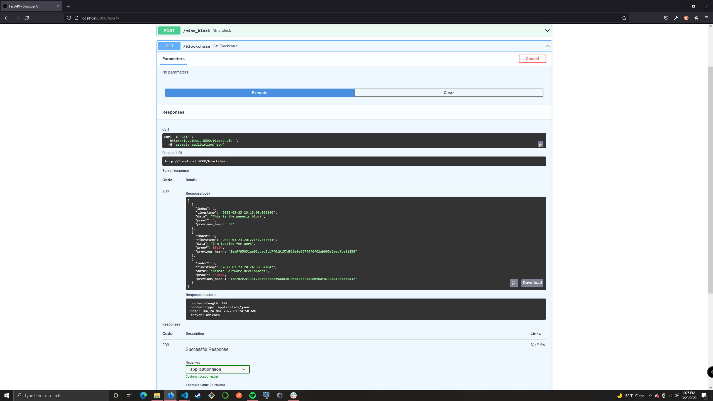

# FastAPI Blockchain

## Description
I am very interested in cryptocurrencies and blockchains but they have always
seemed so complex and mysterious to me. 

I followed a tutorial online and used Python to build my own blockchain. I used FastAPI to interact with the blockchain as an API.

Well, now I can start to wrap my head around how they work. Even if it is a very simple blockchain.

## Instructions
You can try it out yourself by running the python interpreter and importing 'blockchain.py' or by using FastAPI

### Python Interpreter
Start the python interpreter and type in the following to view the first block:

`>>>import blockchain
>>>bc = blockchain.Blockchain()
>>>bc.chain
[{'index': 1, 'timestamp': '2022-03-23 20:06:12.281914', 'data': 'This is the genesis block', 'proof': 1, 'previous_hash': '0'}]`

Type "bc.mine_block('data')" to 'mine' a block. Pass a string as an argument to mine_block. After mining a block, bc.chain should show the new block you just mined as well as any blocks mined before it.

### FastAPI
To use FastAPI to interact with the blockchain, run "uvicorn main:app --reload" and go to localhost:8000/docs in the browser. This will display the endpoints you can use to interact with the blockchain.

